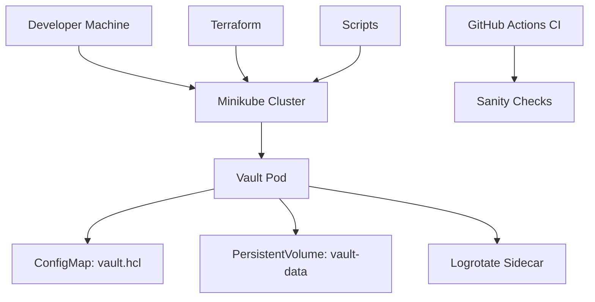

# Vault Kubernetes Deployment Architecture and Design

## Overview

This repository provides a complete infrastructure-as-code solution for deploying HashiCorp Vault on Kubernetes, specifically optimized for local development and testing with Minikube. The deployment uses Terraform for infrastructure management, includes automated initialization scripts, and supports configurable Vault engines with logging and log rotation.

## Architecture

### High-Level Diagram

### Components

#### Terraform Infrastructure (`terraform/`)
- **Provider**: Kubernetes provider for Minikube cluster management.
- **Resources**:
  - `kubernetes_config_map.vault_config`: Stores Vault configuration (`vault.hcl`).
  - `kubernetes_config_map.vault_logrotate`: Logrotate configuration for Vault logs.
  - `kubernetes_persistent_volume.vault_data`: hostPath-based PV for data persistence.
  - `kubernetes_persistent_volume_claim.vault_data`: PVC for data storage.
  - `kubernetes_deployment.vault`: Vault deployment with main container and logrotate sidecar.
  - `kubernetes_service.vault`: NodePort service for external access.
- **Variables**: Configurable via `terraform.tfvars.json` (e.g., image, ports, logging settings).
- **Outputs**: Service NodePort for access.

#### Kubernetes Manifests (`k8s/`)
- Legacy kubectl-based manifests for manual deployment.
- Includes ConfigMap, Deployment, Service, PV, and PVC.

#### Scripts (`scripts/`)
- `terraform-deploy.sh`: Deploys via Terraform, logs to timestamped file.
- `terraform-destroy.sh`: Destroys Terraform-managed resources.
- `minikube-deploy.sh`: Legacy kubectl deployment.
- `vault-init.sh`: Initializes Vault, enables engines, stores root token and recovery key in KV.

#### CI/CD (`.github/workflows/ci.yml`)
- Runs on push/PR to any branch.
- Performs:
  - Shell script validation (shellcheck, bash -n).
  - Terraform formatting, initialization, validation, and planning.

## Deployment Process

1. **Prerequisites**:
   - Minikube running.
   - Terraform installed.
   - Vault CLI installed (for initialization).

2. **Deployment**:
   - Run `./scripts/terraform-deploy.sh` to apply Terraform configuration.
   - Vault pod starts with logrotate sidecar.

3. **Initialization**:
   - Run `./scripts/vault-init.sh` to initialize Vault, unseal, enable engines, and store credentials in KV.

4. **Access**:
   - Vault UI available at Minikube IP:NodePort (default 32000).

5. **Teardown**:
   - Run `./scripts/terraform-destroy.sh` to remove resources.

## Security Considerations

- **TLS**: Disabled for local development; enable in production.
- **Secrets Management**: Root token and recovery key stored in Vault KV mount `vault/root`.
- **Persistence**: Data stored in hostPath PV; not suitable for production.
- **Logging**: Logs rotated with size/compress/copytruncate settings.
- **Access Control**: NodePort exposed; restrict in production environments.

## Configuration

All Vault settings are configurable via `terraform/terraform.tfvars.json`:
- UI enablement, listener settings, storage path, logging level, log rotation parameters.

## Monitoring and Logging

- Vault logs written to `/vault/logs/vault.log` inside the container.
- Logrotate sidecar manages rotation based on size (default 50M).
- Deployment logs saved to `logs/terraform-deploy-YYYYMMDD-HHMMSS.log`.

## Future Enhancements

- Add Helm chart support.
- Integrate with external KMS for auto-unsealing.
- Add monitoring with Prometheus/Grafana.
- Support for production storage backends (e.g., Consul, DynamoDB).

## Maintenance

This document should be updated with any architectural changes, new components, or configuration updates. Ensure all sensitive information (e.g., tokens, keys) is redacted.

Last Updated: May 6, 2026
